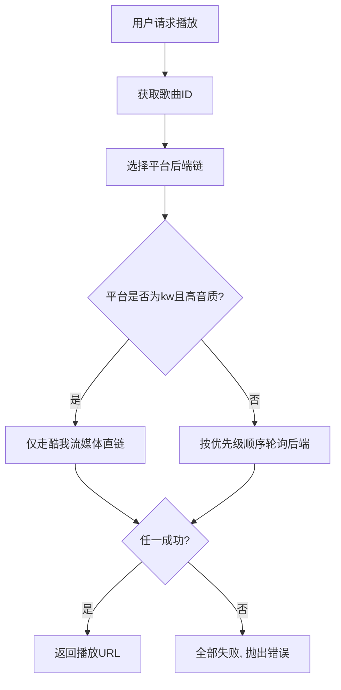

🌊 墨澜音乐源 (Molan Music Source)

https://img.shields.io/badge/version-2.3.0-brightgreen
https://img.shields.io/badge/license-MIT-blue
https://img.shields.io/badge/platform-LX%20Music-orange
https://img.shields.io/badge/PRs-welcome-brightgreen
https://img.shields.io/github/stars/baiji6/molanyinyueyuan?style=social
https://img.shields.io/github/forks/baiji6/molanyinyueyuan?style=social
https://img.shields.io/badge/JavaScript-ES5+-yellow
https://img.shields.io/badge/LX%20Music-custom--source-9cf

汇聚百川，只为每一首歌流畅抵达。
墨澜是专为洛雪音乐（LX Music）打造的超聚合音源，融合 QQ、网易云、酷我、酷狗、咪咕五大平台 90+ 个后端，以多后端轮询、智能降级 和 Cookie 高音质解锁，为您提供流畅的音乐播放体验。

---

📖 目录

· 🎯 项目背景与愿景
· ✨ 核心特性
· 📦 支持的平台与音质
· 🔧 安装与使用
· 🔑 Cookie 配置（解锁高音质）
· 🧠 技术架构
· 📋 完整后端列表
· 📈 更新日志
· 🤝 贡献指南
· ❓ 常见问题 (FAQ)
· 🔗 相关链接与社区
· 📄 许可证
· 🙏 致谢

---

🎯 项目背景与愿景

墨澜的诞生源于一个简单的愿望：让每一位洛雪音乐的用户，无论网络环境如何，无论歌曲版权归属何处，都能流畅地聆听自己喜欢的音乐。

在洛雪音乐丰富的自定义音源生态中，我们观察到既有音源各有千秋，但存在一些共通痛点：

· 后端数量有限，某些平台或歌曲的获取成功率不高；
· 单一后端失效时缺乏备选方案，播放容易中断；
· 高音质（母带、全景声）需要会员 Cookie，配置门槛较高。

墨澜 应运而生。我们：

· 融合 了星海、长青、念心、笒鬼鬼、ChKsZ 等众多成熟后端；
· 引入 了 HYWmusic 公益 API 与 Hello World 独家接口；
· 自研 了多后端顺序轮询与音质自动降级引擎。

最终，墨澜覆盖 QQ、网易、酷我、酷狗、咪咕五大平台，集成 90+ 个后端，支持母带、全景声等高级音质，并通过多后端容错为用户带来无缝听歌体验。

---

✨ 核心特性

🚀 多端聚合，无所不包

· 整合 90+ 个独立后端（含官方接口、公开 API、公益直链、个人维护源）。
· 每个平台均拥有 10+ 个备用后端，单一失效不影响整体。

⚡ 顺序轮询，自动容错

· 按优先级依次请求各后端，首个成功即返回，任一后端超时或返回无效 URL 时自动切换下一可用源。
· 超时控制：每个后端独立超时（8~10 秒），防止慢接口阻塞全局。

🔑 Cookie 解锁，高音质畅享

· 配置 QQ 音乐或网易云音乐 Cookie 后，自动解锁母带、全景声等高级音质。
· 音质列表根据 Cookie 配置自动适配，无需手动调整。

🎵 全音质支持，自动适配

· 从 128k 到 臻品母带、全景声，各平台独立音质列表。
· 智能降级：若请求音质不可用，自动选择最接近的可用音质。

🛡️ 极致稳定，故障隔离

· 任一后端失效，自动跳过并启用下一可用源。
· 高可用设计：即使大部分后端不可用，剩余后端仍能保证正常播放。

🎧 酷我高音质专线

· 酷我音乐母带/全景声走流媒体直链，无需额外 Cookie 即可获取。

🔌 开源透明，社区共建

· MIT 许可证，代码完全开放。
· 欢迎提交 Issue、PR，共同完善生态。

---

📦 支持的平台与音质

平台 支持音质（已配置 Cookie） 支持音质（未配置 Cookie）
QQ音乐 (tx) 128k, 320k, flac, flac24bit, hires, atmos, atmos_plus, master 128k, 320k, flac
网易云音乐 (wy) 128k, 320k, flac, flac24bit, hires, atmos, master 128k, 320k, flac
酷我音乐 (kw) 128k, 192k, 320k, flac, flac24bit 128k, 192k, 320k, flac, flac24bit
酷狗音乐 (kg) 128k, 320k, flac, hires, atmos, master 128k, 320k, flac, hires, atmos, master
咪咕音乐 (mg) 128k, 320k, flac 128k, 320k, flac

💡 提示：高音质（母带、全景声）需对应的平台会员 Cookie，详见下方「Cookie 配置」。

---

🔧 安装与使用

📥 快速开始

1. 打开洛雪音乐 → 进入 设置 → 音源管理 → 自定义音源。
2. 点击右上角 「+」（或「新建」），在编辑框中粘贴墨澜的完整脚本内容。
3. 将脚本名称改为 「墨澜音乐源 (Molan Music Source)」（或任意你喜欢的名字）。
4. 点击 「保存」，然后启用该音源。
5. 在播放列表/歌单的右上角切换音源为 「墨澜音乐源」，即可开始使用。

📄 获取完整脚本

由于脚本内容较长（约 2100+ 行），请直接通过以下方式获取：

· 方式一（推荐）：访问 GitHub Releases 下载最新版 墨澜音乐源v2.3.0.js 文件，用文本编辑器打开后复制全部内容。
· 方式二：在仓库根目录的 墨澜音乐源v2.3.0.js 文件中查看。
· 方式三：通过以下命令快速获取：
  ```bash
  curl -O https://raw.githubusercontent.com/baiji6/molanyinyueyuan/main/墨澜音乐源v2.3.0.js
  ```

注意：确保复制完整，首尾包含 /*! 和 */ 的注释区域，避免语法错误。

🔒 安全提示

· 墨澜仅涉及音乐播放功能，不会收集任何个人隐私数据。
· 若你使用 Cookie 配置，请确保来源安全，切勿分享给他人。

---

🔑 Cookie 配置（解锁高音质）

若你拥有 QQ 音乐或网易云音乐的 VIP/付费会员，可通过配置 Cookie 解锁高音质（如母带、全景声）。
请在脚本顶部注释区（/*! ... */ 内）按以下格式填写：

```javascript
/*!
 * @name 墨澜聚合音源
 * @description 修复wy
 * @version 2.3.0
 * @author 白姬9527(2449067834)
 * @tx_cookie  uin=你的QQ号; skey=你的skey; ...
 * @wy_cookie  MUSIC_U=你的网易云音乐ID; ...
 */
```

如何获取 Cookie？

· QQ音乐：
  1. 在浏览器登录 y.qq.com。
  2. 按 F12 打开开发者工具 → 切换到 Application（应用程序） 标签 → 左侧 Cookies → 选择 https://y.qq.com。
  3. 复制 uin、skey、p_uin、p_skey 等关键字段，拼接成 uin=xxx; skey=xxx; ... 格式。
· 网易云音乐：
  1. 登录 music.163.com。
  2. 同样在开发者工具中查找 MUSIC_U 字段，复制其值。

⚠️ 风险提醒：Cookie 相当于你的登录凭证，请勿泄露给他人。建议使用小号或临时测试账号。

---

🧠 技术架构

整体流程



后端轮询策略

· 顺序轮询：按优先级依次请求各后端，首个成功即返回。
· 独立超时：每个后端独立超时（8~10 秒），慢接口不会阻塞全局。
· 错误收集：所有后端失败时，汇总各后端错误信息一并抛出，便于排查。

音质自动适配

根据是否配置 Cookie 自动选择音质列表（MUSIC_QUALITY）：

· 已配置 QQ + 网易 Cookie：五大平台全部解锁高音质。
· 仅配置 QQ Cookie：仅 QQ 音乐解锁高音质。
· 仅配置网易 Cookie：仅网易云音乐解锁高音质。
· 未配置 Cookie：QQ、网易仅提供 128k/320k/flac，酷我/酷狗/咪咕不受影响。

酷我高音质专线

· 酷我音乐请求 atmos/atmos_plus/master 时，仅走酷我流媒体直链（175.27.166.236:8928），不做降级。
· 普通音质则跳过流媒体直链，走星海、笒鬼鬼、聚合API 等其他后端。

---

📋 完整后端列表

以下列出 v2.3.0 中集成的所有后端（按平台分组）。

QQ 音乐 (tx) – 共 26 个

1. QQ官方（vkey 接口，带 Cookie 可解锁 VIP）
2. 星海主后端（yy.zddyr.top）
3. 星海备后端（zrcdy.dpdns.org）
4. 溯音QQ（oiapi.net）
5. xcvts（api.xcvts.cn）
6. vkeys（api.vkeys.cn）
7. vkeys旧版（api.vkeys.cn）
8. 柳云API（api.liuyunidc.cn）
9. 317ak（api.317ak.cn）
10. nki（api.nki.pw，flac 专用）
11. tang（tang.api.s01s.cn，flac 专用）
12. 玉宁熙（api-v2.yuafeng.cn）
13. 收集聚合（cyapi.top）
14. lxmusic88（88.lxmusic 独家音源 v3/v4）
15. 长青直链（175.27.166.236）
16. 念心直链（music.nxinxz.com）
17. 妖狐（api.yaohud.cn）
18. GDStudio（music-api.gdstudio.xyz）
19. ChKsZ（api.chksz.top）
20. Huibq（lxmusicapi.onrender.com）
21. 聚合API（api.music.lerd.dpdns.org）
22. FishAPI（music.gdstudio.xyz）
23. 汽水VIP（api.vsaa.cn）
24. HYWmusic（103.79.184.97 公益）
25. QQ越权（3 重策略）
26. ygking QQ（api.ygking.cn，全音质）

网易云音乐 (wy) – 共 20 个

1. ikun网易云（c.wwwweb.top）
2. 网易云官方（eapi 接口，带 Cookie 可解锁 VIP）
3. ChKsZ-VIP（api.chksz.top）
4. 笒鬼鬼（api.cenguigui.cn）
5. 溯音163（oiapi.net）
6. toubiec（wyapi.toubiec.cn）
7. GDStudio（music-api.gdstudio.xyz）
8. 星海主后端（yy.zddyr.top）
9. 星海备后端（zrcdy.dpdns.org）
10. bugpk（api.bugpk.com）
11. 念心直链（music.nxinxz.com）
12. 长青直链（175.27.166.236）
13. 妖狐（api.yaohud.cn）
14. lxmusic88（88.lxmusic 独家音源 v4）
15. FishAPI（music.gdstudio.xyz）
16. Huibq（lxmusicapi.onrender.com）
17. 聚合API（api.music.lerd.dpdns.org）
18. 汽水VIP（api.vsaa.cn）
19. HYWmusic（103.79.184.97 公益）
20. 残像 WY（api.canxiang.cn，母带）

酷我音乐 (kw) – 共 17 个

1. 酷我流媒体（175.27.166.236:8928，高音质专线）
2. 星海主后端（yy.zddyr.top）
3. 星海备后端（zrcdy.dpdns.org）
4. 笒鬼鬼（api.cenguigui.cn）
5. 聚合API（api.music.lerd.dpdns.org）
6. 妖狐（api.yaohud.cn）
7. 长青直链（175.27.166.236）
8. 念心直链（music.nxinxz.com）
9. 酷我官方（mobi.kuwo.cn）
10. 酷我手机版（nmobi.kuwo.cn）
11. 酷我车机版（mobi.kuwo.cn）
12. 聆澜（source.shiqianjiang.cn）
13. HYWmusic（103.79.184.97 公益）
14. 溯音酷我（oiapi.net，搜索式）
15. HelloWorld（88.lxmusic，SHA256 签名）
16. yunmge酷我（api.yunmge.com，多码率）
17. 星海酷我（api.xinghai.com，通用聚合）

酷狗音乐 (kg) – 共 18 个

1. 长青海棠（musicserver.haitangw.cc，主 API）
2. 长青SVIP直链（music.haitangw.cc）
3. 长青直链（175.27.166.236）
4. 长青POST（175.27.166.236）
5. 星海主后端（yy.zddyr.top）
6. 星海备后端（zrcdy.dpdns.org）
7. 聚合API（api.music.lerd.dpdns.org）
8. HelloWorld（88.lxmusic，SHA256 签名）
9. 妖狐（api.yaohud.cn）
10. 念心KG（music.nxinxz.com）
11. ChKsZ（api.chksz.top）
12. 海棠API（musicapi.haitangw.net）
13. 酷狗官方（wwwapi.kugou.com）
14. 聆澜（source.shiqianjiang.cn）
15. HYWmusic（103.79.184.97 公益）
16. GDStudio（music-api.gdstudio.xyz）
17. 星海酷狗（api.xinghai.com，通用聚合）
18. 念心酷狗（mcp.nianxinxz.com，多码率）

咪咕音乐 (mg) – 共 12 个

1. 星海主后端（yy.zddyr.top）
2. 星海备后端（zrcdy.dpdns.org）
3. 聚合API（api.music.lerd.dpdns.org）
4. GDStudio（music-api.gdstudio.xyz）
5. Migu直接源（music.migu.cn）
6. Migu API（app.c.nf.migu.cn）
7. 星海后端（api.xinghai-backend.cn）
8. 长青直链（music.haitangw.cc）
9. 念心直链（music.nxinxz.com）
10. 聆澜（source.shiqianjiang.cn）
11. HYWmusic（103.79.184.97 公益）
12. 星海咪咕（api.xinghai.com，通用聚合）

注：实际数量随版本迭代可能增加，请以代码为准。

---

📈 更新日志

v2.3.0 (2026-08-16) 🚀 修复与增强

· 修复网易云音乐（wy）相关问题。
· 新增星澜聚合音源 v3.1.1.1 后端：QQ越权（3 重策略）、ygking QQ、残像 WY（母带）、星海聚合（酷我/酷狗/咪咕）、yunmge 酷我、念心酷狗。
· 酷我音乐新增流媒体直链（atmos/atmos_plus/master 高音质专线）。
· 引入 Hello World API（88.lxmusic，SHA256 签名）与 HYWmusic 公益 API。
· 优化多后端轮询与错误收集逻辑。

更早版本请查看 CHANGELOG.md。

---

🤝 贡献指南

我们欢迎任何形式的贡献，无论是代码、文档还是建议。请遵循以下流程：

🐞 报告 Bug

· 在 Issues 中搜索是否已存在类似问题。
· 若无，请新建 Issue，并附上：
  · 洛雪音乐版本、平台（Win/Mac/Android/iOS）
  · 复现步骤（如特定歌曲、音质）
  · 控制台输出的错误日志（如有）
  · 期望行为 vs 实际行为

💡 提出新功能/后端

· 同样在 Issues 中提议，并说明后端 URL、API 文档链接、支持平台与音质。
· 我们会评估后决定是否纳入。

🔧 提交 Pull Request

1. Fork 本仓库。
2. 在 dev 分支（或 main）创建新分支：feature/your-feature。
3. 遵循现有代码风格（ES5 语法，兼容 LX 沙箱）。
4. 新增后端函数请统一签名：fetch(songmid, quality, musicInfo)，返回 Promise<string>。
5. 在对应平台的 BACKENDS 数组中按优先级插入。
6. 确保所有更改已测试通过（至少手动验证 5 首不同平台的歌曲）。
7. 提交 PR，描述更改内容和测试结果。

📝 完善文档

· 欢迎完善 README、CHANGELOG、Wiki 等。
· 修正错别字、补充示例、添加更多语言（如果需要）。

💬 参与讨论

· 通过 Issues 或 GitHub Discussions 与我们联系。

---

❓ 常见问题 (FAQ)

Q1: 音源无法加载，控制台报错 SyntaxError？

A：确认复制的脚本完整，从 /*! 开始到结尾，没有截断。若仍报错，请从 Releases 下载纯文本文件后复制。

Q2: 播放时提示 无可用源？

A：可能当前平台的所有后端均超时或返回无效 URL。请检查网络连接，或尝试切换音质（如从母带降为 FLAC）。若频繁发生，请在 Issues 中报告，我们会检查后端健康度。

Q3: 如何更新到最新版本？

A：直接编辑自定义音源，将旧脚本替换为新版本内容，保存即可。Cookie 等配置不会丢失。

Q4: 我的 Cookie 安全吗？

A：Cookie 仅存储在本地设备中，墨澜不会上传或外泄。但请注意保管，不要将包含 Cookie 的脚本分享给他人。

Q5: 为什么有些歌曲仍无法播放？

A：可能是：

· 该歌曲在对应平台下架或无版权；
· 你的 Cookie 无效或未配置，导致无法获取 VIP 音质；
· 所有后端均无法获取有效链接（极小概率，可切换音质重试）。

Q6: 酷我/酷狗的母带音质如何解锁？

A：酷我母带/全景声走流媒体直链，无需额外 Cookie；酷狗母带需通过特定后端（如长青海棠、长青SVIP）获取，并非所有歌曲都提供母带资源。若无母带，音质会自动降级。

Q7: 我可以禁用某些后端吗？

A：可以。在脚本的 BACKENDS 数组中，直接注释或删除对应对象即可。但建议保留全部，以保证最大成功率。

Q8: 为什么酷我音乐切换音质后没有反应？

A：酷我音乐的高音质（atmos/atmos_plus/master）仅走流媒体直链，普通音质走其他后端。若某音质不可用，请尝试切换其他音质。

---

🔗 相关链接与社区

· 洛雪音乐官网：https://lxmusic.toside.cn/
· 自定义音源文档：https://lxmusic.toside.cn/mobile/custom-source
· 墨澜项目主页：https://github.com/baiji6/molanyinyueyuan
· HYWmusic 项目：https://github.com/Macrohard0001/HYWmusic_source
· 作者：白姬9527（QQ：2449067834）

---

📄 许可证

本项目采用 MIT 许可证，允许自由使用、修改、分发，只需保留版权声明。详见 LICENSE 文件。

---

🙏 致谢

墨澜的每一行代码都离不开社区的支持，特别感谢：

· 星澜聚合音源 – 提供了 QQ越权、ygking、残像、星海聚合、yunmge、念心酷狗等优质后端。
· ikun 音源 – 提供了网易云音乐 API 与音质格式参考。
· 酷我流媒体音源 – 提供了酷我高音质流媒体直链方案。
· 长青SVIP 音源二改版 – 提供了酷狗长青海棠主 API 与音质映射。
· Hei Music – 提供了 Migu 系列、长青、念心等后端。
· HYWmusic – 公益项目的作者，无私维护免费 API，让更多用户能畅享音乐。
· LX Music 开发团队 – 打造了如此优秀的开源音乐播放器，并开放自定义音源接口。
· 所有参与测试、反馈、提交 PR 的用户 – 你们是墨澜持续进化的动力。

---

墨澜 v2.3.0 —— 汇聚百川，只为每一首歌流畅抵达。
如果你喜欢这个项目，别忘了点 ⭐ Star 支持我们！
如有疑问或建议，请通过 Issues 与我们联系。

🎵 愿音乐常伴，生活如歌。
